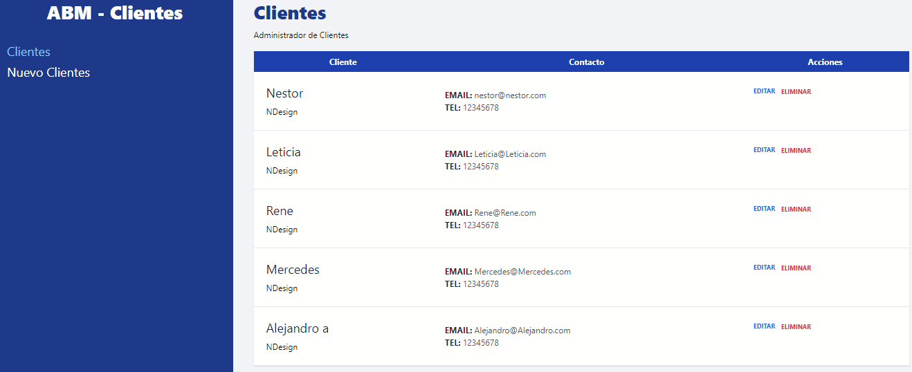
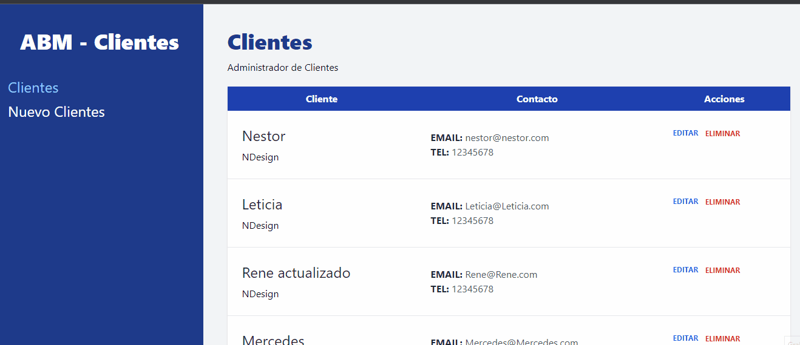
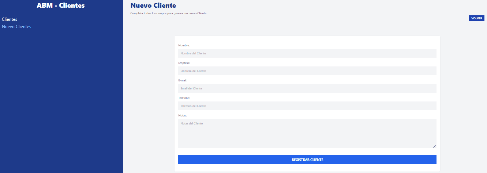

# App | CRM de clientes

### `Realizado por Néstor Gomez`

Correr json server: json-server --watch db.json

Correr APP: npm run dev

Descripción del proyecto:
-Consumir los datos desde generador con la fake Rest Api de Json Server
- Realizar operacion CRUD con Loaders y Actions, basados en la nueva version de react router dom.

Para correr que el proyecto debemos:

- npm run dev

Herramientas utilizadas:

- Vite {React Framework}
- react-router-dom (version >6)
- Uso de Loaders (obtener datos de la fake api) 
- Uso de Actions (envio de datos de formulario)
- Hooks de react: useNavigate - useActionData - useLoaderData
- Direcciomientos mediante:  redirect / navigate / Link
- Componentes React: Link / Error

- Actualizar Cliente

- Eliminar Cliente

-Manejo de errores

-Error al crear registro

